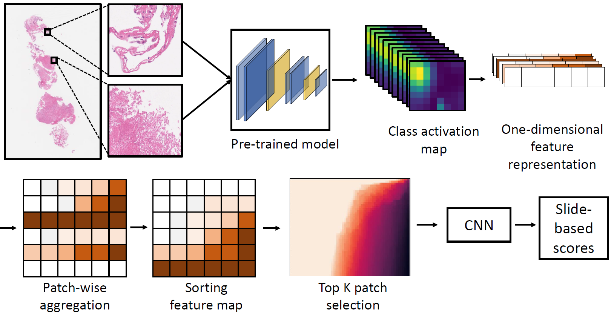

# HipoMap




## Features


## Installation
HipoMap support **Python 3.6+**.

It can be installed through pip, because it is registered and provided with PyPI.

### Dependencies

* Python3 (v3.6 or later)
* Numpy
* Pandas
* Tensorflow (v 1.15 or 2.x)
* Openslide-python
* Scipy
* Scikit-learn
* Seaborn
* Matplotlib
* Cv2

### Installation

Most of dependencies will be installed automatically during installing HipoMap. However, for **openslide-python**, 
you can install it more easily by doing the following:

* Install openslide-tools
```
$ sudo apt-get update
$ sudo apt-get install openslide-tools
```
* Install openslide-python
```
$ pip install openslide
```

After installing ``openslide``, you can install HipoMap with pip3 (with pip in a venv environment).
 
* Install HipoMap
```
$ pip3 install HipoMap
```

## Documentation

## Quick Start

#### Generating Whole-Slide Image based representation map 
```python
#Model load

#If you want to loaded keras pre-trained model
from tensorflow.keras.applications.vgg16 import VGG16

model = VGG16()

#If you want to loaded your pre-trained model(.h5 file)
from tensorflow.keras.models import load_model 

model = load_model(r'./pre_model.h5')

#Make representation map
from HipoMap.hipoMap import generateHipoMap

generateHipoMap(inputpath="/home/user/Dataset/", outputpath="/home/user/Rep/", model = model, layer_name="block5_conv3", patch_size=(224, 224))

```
#### Drawing heatmap with representation map
```python
#Draw heatmap
from HipoMap.hipoMap import draw_represent

draw_represent(path="/home/yeon/Dataset/", K=50, max_value=1000, save=False)
```

#### Classify to Cancer/Normal with representation map

In this step, you must have a baseline file(.csv) for dividing each representatino map generated by train / validation / test set.
```python
#Classify data to cancer/normal with representation map
from HipoMap.hipoClassify import HipoClass
hipo = HipoClass(K=50)

#1. Split data with base(.csv) 
trainset, validset, testset = hipo.split("./split.csv", dir_normal="/home/user/Dataset/Normal/", dir_cancer="/home/user/Dataset/Cancer")

#2. Train the classifier
hipo_model = hipo.fit(trainset, validset, lr=0.1, epoch=20, batchsize=1, activation_size=196)

#3. Get prediction value
prediction = hipo.predict(test_X=testset[0])

#4. Get score (tpr, fpr, auc)
tpr, mean_fpr, auc = hipo.evaluate_score(label=testset[1], prediction=prediction)
```