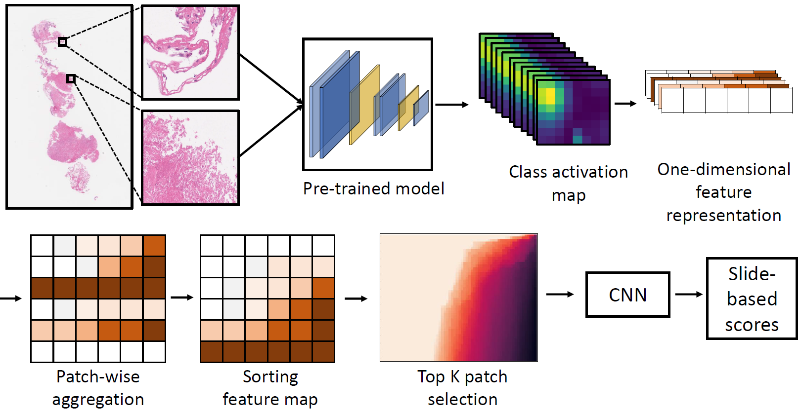

# <a href="http://dataxlab.org/deep-hipo/index.php">HipoMap</a>

[](https://www.dataxlab.org)
[](https://doi.org/10.1038/s41586-020-2649-2)

[](https://pypi.org/project/HipoMap/)
[](https://pypi.org/project/HipoMap/)
[](https://pypi.org/project/HipoMap/)
[](https://pypi.org/project/HipoMap/)



HipoMap is slide-based histopathology analysis framework in which a disease-specific graphical representation map is
generated from each slide. Further, HipoMap, which is a small and fixed size, is introduced as input for
machine-learning models instead of extremely large and variable size WSI. HipoMap is obtained using gradients of patch
probability scores to represent disease-specific morphological patterns. Proposed HipoMap based whole slide analysis has
outperformed current state-of-art whole slide analysis methods. We assessed the proposed method on Lung Cancer WSI
images and interpreted the model based on class probability scores and HipoMap scores. A pathologist clinically verified
the results of interpretation.

- **Website:** http://dataxlab.org/hipo-map
- **Documentation:** https://readthedocs.org/projects/hipo-map/
- **Source code:** https://github.com/datax-lab/HipoMap

It provides:

- a powerful ...
- ...

## Dependencies

### OpenSlide

OpenSlide is a C library that provides a simple interface to read whole-slide images (also known as virtual slides). The
current version is 3.4.1, released 2015-04-20.

For Linux (Fedora), you can install latest version of OpenSlide by running following commands from terminal:

```
$ dnf install openslide
```

For Linux (Debian, Ubuntu), you can install latest version of OpenSlide by running following commands from terminal:

```
$ apt-get install openslide-tools
```

For Linux (RHEL, CentOS), you can install latest version of OpenSlide by running following commands from terminal:

```
$ yum install epel-release
$ yum install openslide
```

For MacOSX, you can install latest version of OpenSlide by running following commands from terminal:

```
$ brew install openslide
```

For Window, you can install latest version of OpenSlide:

```
https://openslide.org/download/#windows-binaries
```

## Installation

Latest PyPI stable release

[](https://pypi.org/project/HipoMap/)
[](https://pypi.org/project/HipoMap/)

```
pip install HipoMap
```

### Dependencies+

[](https://pypi.org/project/HipoMap/)


## Documentation

## Quick Start

#### Generating Whole-Slide Image based representation map

```python
# Model load

# If you want to loaded keras pre-trained model
from tensorflow.keras.applications.vgg16 import VGG16

model = VGG16()

# If you want to loaded your pre-trained model(.h5 file)
from tensorflow.keras.models import load_model

model = load_model(r'./pre_model.h5')

# Make representation map
from hipomap import generateHipoMap

generateHipoMap(inputpath="<path>/Dataset/", outputpath="<path>/Rep/", model=model,
                layer_name="block5_conv3", patch_size=(224, 224))
```

#### Drawing heatmap with representation map

```python
# Draw heatmap
from hipomap import draw_represent

draw_represent(path="<path>/Dataset/", K=50, max_value=1000, save=False)
```

#### Classify to Cancer/Normal with representation map

In this step, you must have a baseline file(.csv) for dividing each representation map generated by train / validation /
test set.

```python
# Classify data to cancer/normal with representation map
from hipomap.classify import HipoClass

hipo = HipoClass(K=50)

# 1. Split data with base(.csv) 
trainset, validset, testset = hipo.split("split.csv", dir_normal="<path>/Dataset/Normal/",
                                         dir_cancer="<path>/Dataset/Cancer")

# 2. Train the classifier
hipo_model = hipo.fit(trainset, validset, lr=0.1, epoch=20, batchsize=1)

# 3. Get prediction value
prediction = hipo.predict_with_test(test_X=testset[0])

# 4. Get score (tpr, fpr, auc)
tpr, mean_fpr, auc = hipo.evaluate_score(label=testset[1], prediction=prediction)
```

#### Generate Probmap with probability score

```python
# Creating probability score array 
from hipomap.scoring import scoring_probmap

scoring_probmap(path_model="./pre_model.h5", path_data="./Dataset/Test/", path_save="./Result/prob_test/")

# Generating Probmap
from hipomap import generating_probmap

generating_probmap(path_data='./Dataset/Test/', path_prob='./Result/prob_test/', path_save='./Result/probmap')
```
