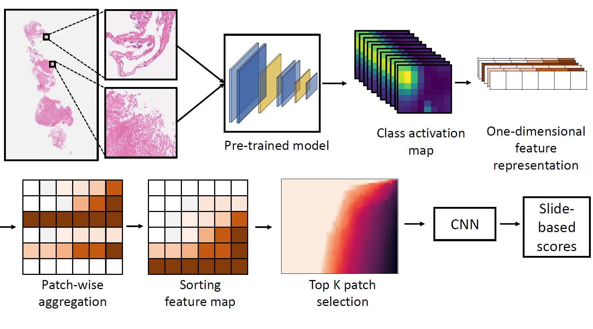

.. HipoMap documentation master file, created by
   sphinx-quickstart on Wed Sep 22 23:04:49 2021.
   You can adapt this file completely to your liking, but it should at least
   contain the root `toctree` directive.

########################
HipoMap Documentation
########################

HipoMap(Histopathology Representation Map) is designed to create a representation map
of the Whole-Slide Images using the deep learning model that you already trained.

.. toctree::
   :maxdepth: 1
   :caption: Getting Started

   getting_started/overview.md
   getting_started/installation.md
   getting_started/quick_start.md

Credit
---------------------

HipoMap was primarily developed by Dr. Sai Kosaraju and Ms. Jeongyeon Park,
with significant contributions and suggestions by Dr. Hyun Lee, Dr. Jung Wook Yang, Dr. Mingon Kang, and many others.
The python package was developed by Jeongyeon Park.
Initial supervision for the project was provided by Dr. Mingon Kang.

Development of HipoMap is carried out in the DataX lab at University of Nevada, Las Vegas (UNLV).

If you use HipoMap in your research, generally it is appropriate to cite the following paper:

.. line-block::
   S. Kosaraju, J. Park, H. Lee, J. Yang, M. Kang, "HipoMap: Graphical Representation Map for Whole Slide-based Histopathological Image Analysis".
